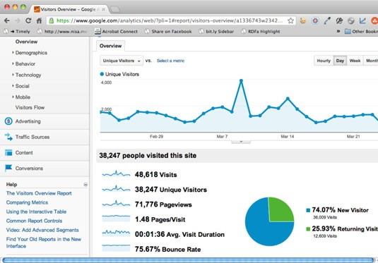
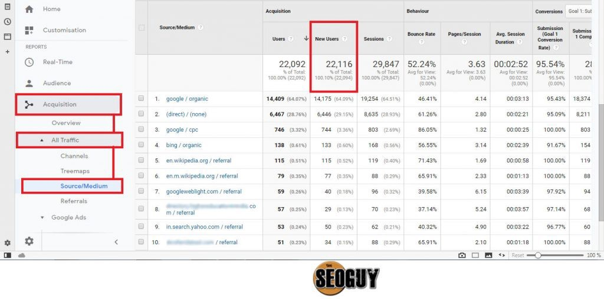
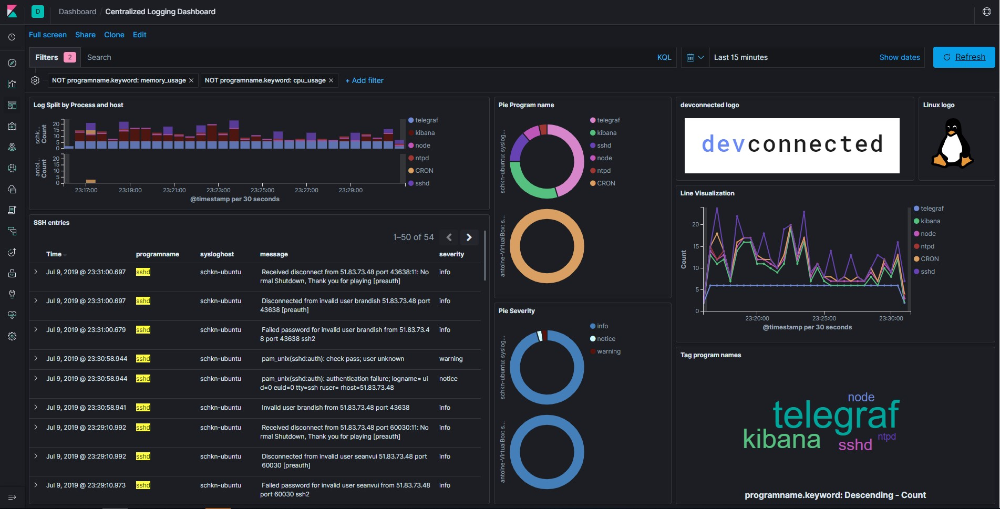

**Activity File 3: Exploring Kibana**

  **Heads Up** : These sample logs are specific to the time you view them. As such, your answers will be different from the answers provided in the solution file.

**Instructions**

1. Add the sample web log data to Kibana.
2. Answer the following questions:
  - In the last 7 days, how many unique visitors were located in India? **71, 776.**
  - In the last 24 hours, of the visitors from China, how many were using Mac OSX? **123**
  - In the last 2 days, what percentage of visitors received 404 errors? How about 503 errors? **21%**
  - In the last 7 days, what country produced the majority of the traffic on the website? **India**
  - Of the traffic that&#39;s coming from that country, what time of day had the highest amount of activity? **6 pm**
  - List all the types of downloaded files that have been identified for the last 7 days, along with a short description of each file type (use Google if you aren&#39;t sure about a particular file type).

The following files types were mostly downloaded from the site

1. .pdf files Portable document format.
2. .png for file for photo files.
3. .move files for movies

1. Now that you have a feel for the data, Let&#39;s dive a bit deeper. Look at the chart that shows Unique Visitors Vs. Average Bytes.
  - Locate the time frame in the last 7 days with the most amount of bytes (activity). **980788Bytes**
  - In your own words, is there anything that seems potentially strange about this activity? **The traffic looks normal from my observation.**
2. Filter the data by this event.
  - What is the timestamp for this event? **06/21/2020 09:35p 6,815 ch.gif**
  - What kind of file was downloaded? **A video file**
  - From what country did this activity originate? **Britain**
  - What HTTP response codes were encountered by this visitor? **200 OK for successful connection**
3. Switch to the Kibana Discover page to see more details about this activity.

- What is the source IP address of this activity? **51.83.73.4**
- What are the geo coordinates of this activity? **53.226658 -0.541254**
- What OS was the source machine running? **The source of the traffic is CentOS.**
- What is the full URL that was accessed? _ **https://www.androidp1.com/file\_5544-dw\_apk.html** _
- From what website did the visitor&#39;s traffic originate? **Imdb.com**
- Finish your investigation with a short overview of your insights.
- What do you think the user was doing? **The user was trying to download a video or stream online.**
- Was the file they downloaded malicious? If not, what is the file used for? **The download was not malicious, the file was a video format, there was nothing malicious**
- Is there anything that seems suspicious about this activity? **The video size is too big, this looks suspicious**
- Is any of the traffic you inspected potentially outside of compliance guidelines?
_ **All traffic was within the expected file and guidelines.** _